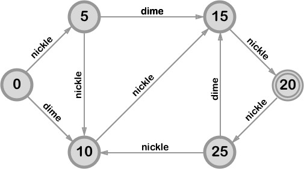

# js-fsm
### Moore Finite State Machine (FSM)

[](https://travis-ci.org/venkatperi/js-fsm)


`js-fsm` is a simple javascript Moore Finite State Machine. A [Moore machine](https://en.wikipedia.org/wiki/Moore_machine) is a finite-state machine whose output values are determined solely by its current state.

# Installation

Install with npm

```shell
npm install js-fsm
```

# Example
### Simple Vending Machine

A vending machine dispenses pieces of candy that cost 20 cents each. The machine accepts nickels and dimes only and does not give change. As soon as the amount deposited equals or exceeds 20 cents, the machine releases a piece of candy. The next coin deposited starts the process over again.



Our state machine has states for the each possible deposited amount: 0 for zero cents deposited, 5 cents, 10 cents, 15 cents, 20 cents and 25 cents.

#### FSM DSL

`js-fsm` uses a simple domain specific language (DSL) for FSM specifications. 

```
initial {
  state: 0;
}

transitions {
  0, 20  -> 5  : nickle;
  0, 20  -> 10 : dime;    
  5, 25  -> 10 : nickle;
  5, 25  -> 15 : dime;
  10     -> 15 : nickle;
  10     -> 20 : dime;
  15     -> 20 : nickle;
  15     -> 25 : dime;
}

outputs {
  ^5,25  :  light5;
  ^10    :  light10;
  ^15    :  light15;
  ^20,25 :  gimmeCandy;
}
```

#### Load the FSM

```coffeescript
jsFSM = require 'js-fsm'
vending = fs.readFileSync("vending.fsm", 'utf8')
fsm = jsFSM().load(vending)
```

#### Operating the vending machine

```coffeescript
# from the example

insert 'nickle'
insert 'dime'
insert 'dime'
insert 'dime'
insert 'dime'
insert 'dime'
insert 'nickle'
```

#### Output

```
  coin   |  from   |   to    |    5    |   10    |   15    |  candy
 ------- + ------- + ------- + ------- + ------- + ------- + -------
 #nickle |    0    |    5    |    x    |         |         |
 ------- + ------- + ------- + ------- + ------- + ------- + -------
  #dime  |    5    |   15    |         |         |    x    |
 ------- + ------- + ------- + ------- + ------- + ------- + -------
  #dime  |   15    |   25    |    x    |         |         |    x
 ------- + ------- + ------- + ------- + ------- + ------- + -------
  #dime  |   25    |   15    |         |         |    x    |
 ------- + ------- + ------- + ------- + ------- + ------- + -------
  #dime  |   15    |   25    |    x    |         |         |    x
 ------- + ------- + ------- + ------- + ------- + ------- + -------
  #dime  |   25    |   15    |         |         |    x    |
 ------- + ------- + ------- + ------- + ------- + ------- + -------
 #nickle |   15    |   20    |         |         |         |    x
 ------- + ------- + ------- + ------- + ------- + ------- + -------
```

# The FSM DSL

`js-fsm` uses a simple domain specific language (DSL) for its FSM specifications. The DSL parser is uses the [jison](http://jison.org) module.

A FSM specification must include the following sections:

* **initial** - startup information, such as the initial state.
* **transitions** - specifies state-to-state transitions and the necessary input conditions to enable the transitions.
* **outputs** - specifies the outputs for states. 

### Initial

Specify the starting state:

```
initial {
  state: state1;
}
```

### Transitions

A transition is specified as:

```
<from states> -> <to state> : <inputs>;
```

where:

* **from states** is a comma separated list of source states to transition from. This list of states is to be interpreted in a boolean **or** sense, i.e. by a from state list of `state1`, `state2`, `state3`, we mean: 'if the FSM in one of `state1` or `state2` or `state3`'. 

  ```
  from states = <state 1> OR <state 2> OR ... OR <state n>
  ```

* **to state** is the state to transition to.

* **inputs**  is a comma separated list of input conditions necessary to enable the transition. The list of inputs is interpreted in an **and** boolean sense so that an input list of `input1`, `input2`, `input3` is 'all of `input1` **and** `input2` **and** `input3` must be true'. Inputs can be inverted  with by prefixing with an exclamation operator to indicate a false/low, i.e. `input1`, `! input2` is ' when `input1` is true and `input2` is false'.

  ```
  contidions = <input 1> AND <input 2> AND ... AND <input n>
  ...
  conditions = <input x> AND !<input y>
  ```

### Outputs

Outputs are spefified for states:

```
<state list> : <output list>;
```

where:

* **state list** - a comma separated list of states which share a common set of outputs. The list is interepreted in a boolean **or** sense, i.e. 'if in any of the states of `state1` or `state2`, set the outputs as follows.' The state list can be optionally prefixed with the following operators to modify its meaning:
  * `!`  **exclamation** operator  -  exclude the provided list  i.e. `all states` **minus** `state list`.
  * `^` - **caret** operator -  the provided list is `if-and-only-if` . i.e. set the outputs as indicated if the FSM is in one of the the listed states. If the FSM is not in the listed states, set the outputs to the inverse of the listed values.

# API

## Create FSM

### jsFSM()

Create a FSM object.

## Methods

### fsm.load(spec)

Load the FSM specification from the given `{String}`.

### fsm.signal([value])

Gets or sets the value of the named signal (signal must be replaced with the appropriate name above).

```coffeescript
#set signal nickle to true and dime to false
fsm
.nickle true
.dime false
```

#### Aliases

* `fsm.set(name)` sets the `{String}` signal to true.
* `fsm.rese(name)` resets the `{String}` signal to false.
* `fsm.setSignal()` sets signal.
* `ism.resetSignal()` resets signal.

### fsm.clock()

Instructs the FSM to attempt a transition based on the current input values. If no transition is possible, the fsm will emit a `noop` event. 

```coffeescript
# sets input values and and transitions (if possible)
fsm
.dime false
.nickle true
.clock()
```

### fsm.current()
The current state's name

## Events 

### on('noop', cb())

`fsm.clock()` resulted in no state change.

### on('state', cb(state, from, desc))

Fired when the FSM transitions to a state. The callback **cb** receives the state names **state**, **from** and a string description of why the transition occured.

### on('error', cb(Error))
Fired if an error occurs. e.g. to many transitions from a state.

### on('changed:signal', cb(new, old))
Fired when a signal value changes. Signal values can change either by the user by calling fsm.signal(value), or as a result of entering a new state.

## Order of Events

On a state change, events are emitted in the following order:
* `changed:signal` for any changed output/signals
* `state`


